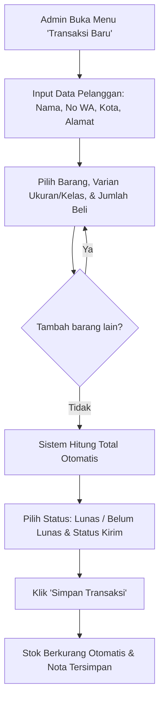
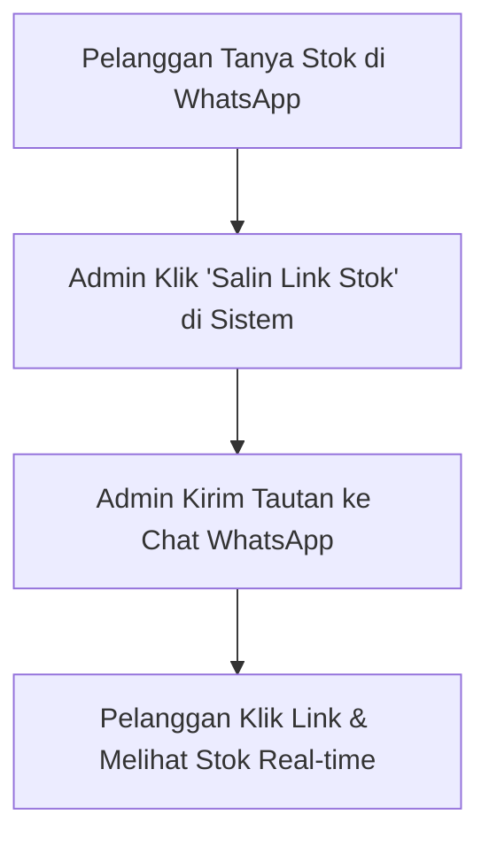
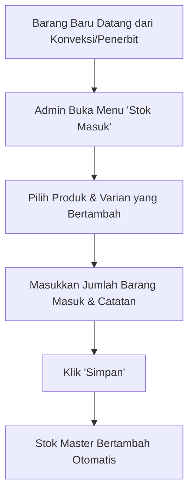

# Product Requirement Document (PRD) - MyKopsyah

**Versi:** 1.0 (Final Draft)  
**Status:** Siap Digunakan untuk Prompt Pembangunan Sistem  
**Target Platform:** Web Application (Mobile-Friendly Responsive, Hosted on Vercel Free-Tier)

---

## 1. Problem & Users

### 1.1 Problem Statement
Kopsyah (Koperasi Syariah) menjual berbagai perlengkapan santri dan guru, seperti baju seragam santri/santriwati (dengan berbagai ukuran dan harga berjenjang), buku pelajaran santri soleh (berdasarkan kelas dan semester), peci, jilbab, hingga kain bahan batik guru. 

Saat ini, pengelolaan stok dan pencatatan transaksi masih dilakukan secara manual atau terpisah-pisah, sehingga menimbulkan beberapa kendala:
1. **Pencatatan Stok Rentan Selisih:** Perhitungan stok fisik dan sisa barang seringkali tidak sinkron karena tidak ada pengurangan stok otomatis saat ada pesanan keluar.
2. **Kerepotan Menjawab Pertanyaan Stok:** Pelanggan (wali santri, pengurus pondok pesantren, instansi) sering menanyakan ketersediaan stok melalui WhatsApp, sehingga Admin harus mengecek fisik barang berulang kali.
3. **Penghitungan Manual Total Belanja:** Pelanggan sering membeli banyak item sekaligus dengan kombinasi varian ukuran berbeda, sehingga rawan salah hitung total harga.
4. **Kesulitan Tracking Piutang & Pengiriman:** Sulit memantau pesanan mana yang belum lunas serta pesanan instansi mana yang belum dikirim.
5. **Ketiadaan Rekap Penjualan per Wilayah:** Admin kesulitan mengetahui sebaran pesanan berdasarkan kota/kabupaten tujuan tanpa rekap manual berlembar-lembar.

### 1.2 Target Users
* **Primary User (Admin Kopsyah):** 
  * Pengurus/staf Koperasi Kopsyah (usia senior, awam teknologi).
  * Membutuhkan sistem yang **sangat sederhana**, minim langkah klik, tombol berukuran jelas, bahasa Indonesia yang ramah (tanpa istilah teknis/jargon IT rumit), dan dapat diakses dengan nyaman melalui browser handphone (smartphone) maupun laptop.
* **Secondary User (Pelanggan / Calon Pembeli - Public View):**
  * Wali santri, koordinator rombongan, atau perwakilan pondok pesantren / sekolah mitra.
  * Mengakses halaman publik (read-only) melalui tautan web untuk mengecek ketersediaan stok produk secara mandiri tanpa perlu login.

### 1.3 User Needs & Pain Points
| Pengguna | Kebutuhan Utama (Needs) | Titik Masalah Saat Ini (Pain Points) |
|---|---|---|
| **Admin Kopsyah** | Kemudahan input barang masuk & transaksi penjualan dalam hitungan menit | Harus hitung manual pakai kalkulator; sering salah catat varian ukuran |
| **Admin Kopsyah** | Stok berkurang otomatis secara akurat setiap kali ada transaksi | Sering terjadi selisih antara catatan pembukuan dan stok fisik di gudang |
| **Admin Kopsyah** | Membagikan info stok ke pelanggan dengan cepat | Lelah mengetik ulang dan memeriksa fisik barang setiap ada yang tanya di WA |
| **Admin Kopsyah** | Melihat daftar transaksi yang Belum Lunas & Belum Dikirim | Sering terlewat menagih atau lupa mengirim pesanan instansi |
| **Admin Kopsyah** | Rekap penjualan otomatis per kota/kabupaten | Memakan waktu berjam-jam saat membuat laporan tahunan/bulanan |
| **Pelanggan** | Informasi ketersediaan barang yang pasti dan transparan | Menunggu respon admin lama hanya untuk tahu stok ukuran baju tertentu habis/ada |

### 1.4 Project Goal
Membangun satu sistem web terpadu, ringan, mudah digunakan oleh admin awam, serta gratis dalam biaya operasional (dapat dideploy di Vercel free-tier), yang berfungsi untuk:
1. Mengelola data produk dan varian (ukuran, kelas, semester, harga).
2. Mencatat penambahan stok (Stok Masuk) dan pengurangan stok otomatis melalui Transaksi Penjualan.
3. Menyediakan halaman publik khusus (Read-Only Stok) yang bisa dibagikan link-nya kepada pelanggan.
4. Mengontrol status pembayaran (Lunas / Belum Lunas) dan status pengiriman (Belum Dikirim / Sudah Dikirim).
5. Menyediakan laporan ringkas stok, riwayat penjualan, dan rekap sebaran pelanggan per wilayah secara otomatis.

---

## 2. Product Requirements

### 2.1 Functional Requirements
1. **Autentikasi Sederhana:**
   * Login Admin sederhana dengan PIN / kata sandi tunggal (single-admin).
   * Session tetap aktif agar admin tidak perlu login berulang-ulang di perangkat yang sama.
2. **Katalog Produk & Varian:**
   * Menampilkan daftar produk beserta kategori/tipe.
   * Mendukung produk dengan varian (Baju Santri/wati berukuran angka 1–10+, Buku Santri Soleh Kelas 1–4 Sem 1–2, Peci & Jilbab berukuran) maupun produk tanpa varian (Baju Dasar Batik Guru).
   * Setiap varian dapat memiliki harga jual dan stok tersendiri.
   * Mengubah data harga atau menambah varian baru sewaktu-waktu.
3. **Manajemen Stok Masuk:**
   * Form cepat penambahan stok per produk & varian.
   * Catatan riwayat stok masuk (tanggal, jumlah, catatan/sumber barang).
4. **Transaksi Penjualan (Kasir / Pesanan):**
   * Input data pelanggan: Kategori (Instansi / Perorangan), Nama Pemesan/Instansi, Nama Penerima Paket, No. WhatsApp/Telepon, Alamat Pengiriman, serta Kota/Kabupaten & Provinsi.
   * Multi-item order: Dapat memilih beberapa produk dan kombinasi varian ukuran sekaligus dalam 1 nota/transaksi.
   * Perhitungan subtotal dan total otomatis.
   * Snapshot harga jual: Harga produk saat transaksi disimpan terkunci permanen agar laporan keuangan masa lalu tidak berubah jika harga master naik/turun di masa depan.
   * Pengurangan stok otomatis saat transaksi disimpan.
   * Status Pembayaran: Default "Belum Lunas" atau "Lunas" (dapat diubah statusnya kapan saja dengan 1 klik).
   * Status Pengiriman: Default "Belum Dikirim" atau "Sudah Dikirim" (dapat diubah statusnya kapan saja).
   * Fitur pembatalan/hapus transaksi yang secara otomatis mengembalikan jumlah stok (*rollback*).
5. **Halaman Publik Cek Stok (Public Stock Page):**
   * Halaman web terbuka tanpa login (`/stok` atau `/cek-stok`).
   * Desain bersih dan mudah dibaca di layar HP pelanggan.
   * Hanya menampilkan nama barang, varian/ukuran, harga, dan status ketersediaan (Tersedia / Stok Menipis / Habis).
   * Tombol satu klik bagi Admin di panel dasbor: "Salin Link Stok" untuk langsung ditempelkan ke WhatsApp pelanggan.
6. **Laporan & Rekap:**
   * **Dasbor Ringkas:** Kartu total produk, total omset/penjualan, jumlah transaksi belum lunas, dan peringatan barang yang stoknya menipis/habis.
   * **Laporan Transaksi:** Riwayat nota penjualan dengan filter status (Semua / Belum Lunas / Belum Dikirim).
   * **Rekap Wilayah:** Tabel ringkasan total pesanan dan total nilai belanja dikelompokkan berdasarkan Kota/Kabupaten.

### 2.2 Non-Functional Requirements
1. **Kemudahan Penggunaan (Usability / Senior-Friendly):**
   * Ukuran font proporsional dan mudah dibaca.
   * Tombol aksi utama (Simpan, Tambah, Salin Link) berukuran besar dan kontras.
   * Menggunakan istilah Bahasa Indonesia sehari-hari (contoh: "Barang Masuk", "Catat Penjualan", "Belum Lunas", bukan istilah teknis seperti "Inventory Inflow" atau "AR Aging").
   * Konfirmasi sederhana saat melakukan aksi berbahaya (seperti menghapus transaksi).
2. **Kinerja & Kompatibilitas:**
   * Halaman publik harus sangat ringan (< 1 detik load time) agar hemat kuota internet pelanggan.
   * Tampilan responsif sempurna di perangkat mobile (Android/iOS browser).
3. **Biaya Infrastruktur (Cost-Efficiency):**
   * Dapat di-hosting 100% gratis menggunakan layanan Vercel (Front-end & Serverless) dipadukan dengan database gratis (misal Supabase, Neon PostgreSQL, atau Turso SQLite).

### 2.3 Core Features
1. **Dasbor Utama (Dashboard):** Ringkasan kilat stok kritis, pesanan tertunda, dan jalan pintas ke transaksi baru.
2. **Katalog & Stok:** Tabel stok real-time per ukuran/kelas, tombol tambah stok masuk cepat.
3. **Kasir / Catat Transaksi Baru:** Input nama pembeli, pilih barang & varian, total otomatis, set status bayar & kirim.
4. **Daftar Pesanan & Piutang:** Daftar nota transaksi, filter Belum Lunas, filter Belum Dikirim, tombol ubah status sekali sentuh.
5. **Halaman Cek Stok Publik:** Tampilan read-only untuk pelanggan yang siap dibagikan via WhatsApp.
6. **Laporan Penjualan & Wilayah:** Rekap otomatis penjualan berdasarkan Kota/Kabupaten.

### 2.4 User Flow

#### A. Alur Admin Mencatat Transaksi Penjualan

#### B. Alur Pelanggan Menanyakan Stok

#### C. Alur Admin Menambah Stok Masuk

### 2.5 Data Requirements

#### 1. Entitas `Product` (Master Produk)
* `id` (Primary Key)
* `name` (String, contoh: "Baju Santri (Putra)", "Buku Santri Soleh", "Baju Dasar Batik Guru")
* `category` (Enum / String: "Seragam", "Buku", "Aksesoris", "Kain")
* `has_variants` (Boolean: True jika punya ukuran/kelas, False jika produk tunggal)
* `unit` (String, default: "Pcs", "Stel", atau "Potong")
* `description` (Text, opsional)
* `created_at`, `updated_at` (Timestamp)

#### 2. Entitas `ProductVariant` (Varian & Stok)
* `id` (Primary Key)
* `product_id` (Foreign Key ke `Product`)
* `variant_name` (String, contoh: "Ukuran 3", "Ukuran 7", "Kelas 1 - Sem 1", "Standar")
* `price` (Decimal/Integer, harga jual khusus varian ini dalam Rupiah)
* `stock_quantity` (Integer, jumlah stok fisik saat ini)
* `sku_code` (String, opsional)

#### 3. Entitas `Customer` (Data Pelanggan)
* `id` (Primary Key)
* `customer_type` (Enum: "Instansi / Pesantren", "Perorangan")
* `institution_name` (String, nama pondok pesantren/sekolah, opsional jika perorangan)
* `contact_person` (String, nama orang penerima / pemesan)
* `phone_number` (String, nomor WhatsApp aktif)
* `city` (String, Kota / Kabupaten pengiriman, untuk kebutuhan rekap wilayah)
* `province` (String, Provinsi)
* `full_address` (Text, alamat lengkap pengiriman)

#### 4. Entitas `Transaction` (Nota Transaksi Keluar)
* `id` (Primary Key)
* `invoice_number` (String unik, contoh: `KP-202610-001`)
* `customer_id` (Foreign Key ke `Customer`)
* `customer_name_snapshot` (String, nama instansi/pemesan saat transaksi)
* `recipient_name` (String, nama orang penerima paket)
* `recipient_phone` (String, no HP penerima)
* `city_snapshot` (String, Kota/Kabupaten pengiriman)
* `full_address_snapshot` (Text, alamat lengkap pengiriman)
* `payment_status` (Enum: "Belum Lunas", "Lunas")
* `shipping_status` (Enum: "Belum Dikirim", "Sudah Dikirim")
* `total_amount` (Decimal/Integer, total nilai transaksi)
* `notes` (Text, catatan pesanan)
* `created_at` (Timestamp, tanggal transaksi dibuat)

#### 5. Entitas `TransactionItem` (Detail Barang Pesanan)
* `id` (Primary Key)
* `transaction_id` (Foreign Key ke `Transaction`)
* `product_id` (Foreign Key ke `Product`)
* `variant_id` (Foreign Key ke `ProductVariant`)
* `item_name_snapshot` (String, nama produk & varian saat transaksi)
* `unit_price` (Decimal/Integer, harga per pcs saat transaksi dibuat)
* `quantity` (Integer, jumlah yang dibeli)
* `subtotal` (Decimal/Integer, `unit_price * quantity`)

#### 6. Entitas `StockEntry` (Riwayat Stok Masuk)
* `id` (Primary Key)
* `variant_id` (Foreign Key ke `ProductVariant`)
* `quantity_added` (Integer, jumlah barang yang masuk)
* `supplier_or_notes` (String, asal kiriman atau keterangan konveksi/penerbit)
* `created_at` (Timestamp)

### 2.6 Constraints & Assumptions

#### Batasan Teknis
| Batasan | Keterangan |
|---|---|
| **Hosting Gratis** | Sistem harus dapat berjalan optimal di free-tier Vercel dan database cloud gratis (seperti Supabase / Neon / Turso). |
| **Satu Akun Admin** | Sistem dirancang untuk satu admin pengelola toko/gudang, tanpa sistem multi-role / hierarki akun yang rumit. |
| **Koneksi Internet** | Berbasis cloud web, membutuhkan koneksi internet untuk sinkronisasi data real-time. |
| **Akses Browser** | Tidak membuat aplikasi native Android/iOS (APK); pengguna mengakses melalui browser ponsel/komputer. |

#### Asumsi Bisnis
| Asumsi | Keterangan |
|---|---|
| **Satu Lokasi Gudang** | Tidak memerlukan fitur multi-gudang (semua stok dihitung terpusat di Kopsyah). |
| **Setup Stok Awal** | Stok awal dimasukkan oleh Admin melalui form Stok Masuk saat inisialisasi sistem. |
| **Fokus Penjualan Keluar** | Transaksi yang dicatat difokuskan pada penjualan ke pelanggan/santri/pesantren. |
| **Mata Uang Tunggal** | Semua transaksi dalam mata uang Rupiah (IDR). |
| **Ongkos Kirim Terpisah** | Biaya ongkir dibayarkan langsung oleh pelanggan ke ekspedisi/pihak luar sehingga tidak masuk perhitungan omset toko di sistem. |
| **Tanpa Modul Retur** | Proses barang retur ditangani manual dan disesuaikan lewat penambahan stok masuk jika barang kembali ke gudang. |

### 2.7 Success Criteria
| # | Kriteria Keberhasilan | Indikator Pencapaian |
|---|---|---|
| **S1** | **Stok Selalu Akurat** | Jumlah stok di sistem otomatis sinkron dengan barang keluar/masuk tanpa perlu rekonsiliasi manual. |
| **S2** | **Input Cepat & Anti-Ribet** | Admin dapat mencatat transaksi multi-barang dalam waktu kurang dari 2 menit lewat ponsel. |
| **S3** | **Bebas Salah Hitung** | Perhitungan total nota belanja 100% otomatis dan akurat. |
| **S4** | **Kemudahan Berbagi Stok** | Admin dapat menyalin dan membagikan tautan cek stok publik ke WhatsApp dalam 1 klik. |
| **S5** | **Pemantauan Piutang & Pengiriman Jelas** | Transaksi yang belum lunas atau belum dikirim dapat difilter dalam 1 layar dasbor. |
| **S6** | **Rekap Wilayah Otomatis** | Laporan sebaran pesanan per Kota/Kabupaten langsung tersaji tanpa perlu rekap excel manual. |
| **S7** | **Ramah Pengguna Senior** | Admin yang awam teknologi dapat mengoperasikan sistem secara mandiri setelah 1 kali uji coba. |

---

## 3. Scope

### 3.1 In Scope (Termasuk dalam Sistem)
* **Manajemen Master Produk & Varian:** Tambah, edit, dan atur harga serta nama varian (angka ukuran baju/peci/jilbab, kelas & semester buku, serta kain batik tanpa ukuran).
* **Pencatatan Stok Masuk:** Menambah jumlah fisik barang ke varian tertentu dengan catatan tanggal & keterangan.
* **Pencatatan Transaksi Penjualan (Kasir Multi-Item):** Input data pemesan/instansi, pilih barang dan varian, kalkulasi otomatis, dan pencatatan snapshot harga.
* **Pengurangan & Pengembalian Stok Otomatis:** Stok langsung berkurang saat transaksi dibuat, dan kembali jika transaksi dihapus.
* **Manajemen Status Pembayaran & Pengiriman:** Toggle status "Lunas / Belum Lunas" dan "Sudah Dikirim / Belum Dikirim".
* **Halaman Web Cek Stok Publik:** Halaman khusus tanpa login dengan link ramah bagikan untuk pelanggan mengecek ketersediaan barang.
* **Laporan Sederhana:**
  * Laporan stok saat ini & peringatan stok menipis.
  * Laporan riwayat transaksi & filter status piutang/pengiriman.
  * Laporan rekap total penjualan per kota/kabupaten.
* **Single Admin Authentication:** Proteksi halaman pengelola dengan kata sandi/PIN sederhana.

### 3.2 Out of Scope (Tidak Termasuk dalam Sistem)
* Penyimpanan file bukti transfer / upload struk pembayaran (tidak diperlukan pada fase ini).
* Perhitungan dan pencatatan ongkos kirim ekspedisi di dalam sistem.
* Modul retur barang otomatis atau klaim garansi.
* Multi-user dengan hak akses bertingkat (RBAC/Multi-role).
* Notifikasi WhatsApp otomatis lewat API berbayar (misal WhatsApp Business API / Fonnte).
* Payment Gateway otomatis (Midtrans, Xendit, dsb).
* Aplikasi mobile native (Play Store APK atau Apple App Store).

---

## 4. AI Prompt Context

> Bagian ini disiapkan khusus sebagai referensi instruksi terstruktur untuk AI Coding Assistant saat tahap pembangunan aplikasi dimulai.

### 4.1 Ringkasan Proyek (Project Overview)
MyKopsyah adalah aplikasi web manajemen stok dan penjualan berbasis web yang dirancang khusus untuk Koperasi Syariah (Kopsyah). Sistem ini mengelola produk perlengkapan santri (seragam berukuran angka, buku pelajaran per kelas & semester, peci, jilbab, dan kain batik) dengan antarmuka yang sangat ramah bagi admin senior/awam teknologi. Sistem ini juga dilengkapi tautan publik untuk pelanggan mengecek stok secara langsung.

### 4.2 Target Pengguna (Target User)
* **Admin Toko:** Satu pengguna, awam teknologi, mengakses lewat ponsel/laptop. Antarmuka harus bersih, tombol besar, font jelas, dan alur kerja minim klik.
* **Pelanggan:** Membuka tautan cek stok publik melalui browser handphone tanpa login.

### 4.3 Tujuan Utama (Project Goal)
Menghilangkan pencatatan manual di buku, mengotomatiskan pengurangan stok, memudahkan pembagian info stok ke pelanggan via WhatsApp, dan memantau status piutang (Belum Lunas) serta pengiriman (Belum Dikirim) tanpa biaya operasional langganan server (free-tier Vercel).

### 4.4 Rekomendasi Teknologi (Tech Stack)
* **Framework:** Next.js (App Router) atau Vite + React.
* **Styling:** Vanilla CSS atau Tailwind CSS (desain bersih, modern, kontras tinggi, mobile-friendly).
* **Database:** PostgreSQL gratis (Supabase / Neon) atau SQLite cloud (Turso) dengan ORM (Prisma / Drizzle) yang mudah diintegrasikan di serverless Vercel.
* **State & Form:** React Hook Form / native form handling dengan validasi sederhana.
* **Deployment:** Vercel (Free Hobby Plan).

### 4.5 Fitur Kunci yang Wajib Diimplementasikan (Key Features)
1. **Dasbor Ringkas:** Metrik penjualan, peringatan stok habis/kritis, dan filter nota belum lunas.
2. **Katalog Produk Fleksibel:** Dukungan produk bervarian (ukuran/semester) dan produk non-varian (kain batik).
3. **Pencatatan Stok Masuk:** Formulir cepat tambah stok.
4. **Formulir Transaksi Penjualan:**
   * Data pelanggan lengkap (Nama, WhatsApp, Instansi, Penerima, Kota, Alamat).
   * Pemilihan multi-barang dengan kalkulasi harga seketika.
   * Kunci snapshot harga saat nota disimpan.
   * Auto-pengurangan stok fisik.
5. **Halaman Publik `/stok`:** Akses bebas untuk umum, menyajikan ketersediaan barang dengan label "Tersedia", "Sisa Sedikit", atau "Habis".
6. **Tombol "Salin Link Stok":** Menyalin URL cek stok ke clipboard dalam satu ketukan untuk ditempel di WhatsApp.
7. **Rekapitulasi Wilayah:** Halaman ringkasan rekap pesanan per Kota/Kabupaten.

### 4.6 Batasan Penting (Constraints for AI Developer)
* Jangan membuat alur login berjenjang atau registrasi umum; cukup otentikasi admin berbasis PIN/password sederhana.
* Jangan menambahkan fitur upload bukti transfer, payment gateway, atau kalkulator ongkos kirim.
* Pastikan logika pembatalan nota transaksi secara aman mengembalikan stok (*inventory rollback*).
* Desain antarmuka harus memprioritaskan keterbacaan di layar handphone (mobile-first).
